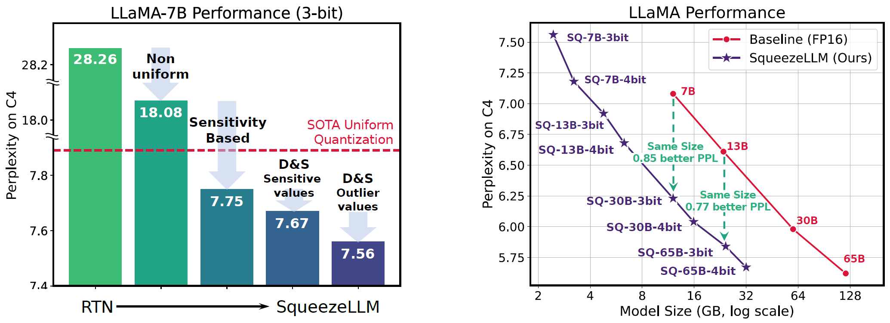

# SqueezeLLM: Dense-and-Sparse Quantization [[Paper](https://arxiv.org/abs/2306.07629)]




SqueezeLLM is a post-training quantization framework that incorporates a new method called Dense-and-Sparse Quantization to enable efficient LLM serving.

TLDR:
Deploying LLMs is difficult due to their large memory size. This can be addressed with reduced precision quantization. But a naive method hurts performance. We address this with a new Dense-and-Sparse Quantization method.
Dense-and-Sparse splits weight matrices into two components: A dense component that can be heavily quantized without affecting model performance, as well as a sparse part that preserves sensitive and outlier parts of the weight matrices
With this approach, we are able to serve larger models with smaller memory footprint, the same latency, and **yet higher accuracy and quality**.
For instance, the Squeeze variant of the Vicuna models can be served within 6 GB of memory and reach 2% higher MMLU than the baseline model in FP16 with an even 2x larger memory footprint.
For more details please check out our [paper](https://arxiv.org/abs/2306.07629v2).

**Updates (2/5):** Dense and sparse quantization and packing codes for custom models are now available.

**Updates (11/28):** Mistral model is now supported.

**News (10/21):** [SqueezeLLM](https://github.com/vllm-project/vllm/blob/1f24755bf802a2061bd46f3dd1191b7898f13f45/vllm/model_executor/quantization_utils/squeezellm.py#L8) is now supported within the official [vLLM](https://github.com/vllm-project/vllm) framework.

**Updates (9/30):** The code for quantizing custom models is now available ([link](https://github.com/SqueezeAILab/SqueezeLLM#from-scratch-quantization)).

---
## Installation

1. Create a conda environment
```
conda create --name sqllm python=3.9 -y
conda activate sqllm
```

2. Clone and install the dependencies
```
git clone https://github.com/SqueezeAILab/SqueezeLLM
cd SqueezeLLM
pip install -e .
cd squeezellm
python setup_cuda.py install
```

---

## From-scratch Quantization 

To quantize your own models, follow the procedure in this [link](https://github.com/SqueezeAILab/SqueezeLLM/tree/main/quantization). 


## Supported Models

Currently, we support [LLaMA](https://arxiv.org/abs/2302.13971) 7B, 13B, 30B and 65B, [LLaMA-2](https://arxiv.org/abs/2307.09288) 7B and 13B, instruction-tuned [Vicuna](https://lmsys.org/blog/2023-03-30-vicuna/) 7B and 13B, [XGen](https://blog.salesforceairesearch.com/xgen/) 7B with 8k sequence length, and OPT 1.3B to 30B.
For each model, we support 3-bit and 4-bit quantized models, with sparse levels of 0% (dense-only), 0.05%, and 0.45%.
See our [Paper](https://arxiv.org/abs/2306.07629) for more detailed information on these configurations.
Below are the links to download the models.

### LLaMA (v1)

| Model |  Bitwidth | Dense-only (0%) | 0.05% Sparsity | 0.45% sparsity |
| -------- | -------- | -------- | ------ | ---- |
| LLaMA-7B    | 3   |  [sq-llama-7b-w3-s0](https://huggingface.co/squeeze-ai-lab/sq-llama-7b-w3-s0/blob/main/sq-llama-7b-w3-s0.pt) | [sq-llama-7b-w3-s5](https://huggingface.co/squeeze-ai-lab/sq-llama-7b-w3-s5/blob/main/sq-llama-7b-w3-s5.pt) | [sq-llama-7b-w3-s45](https://huggingface.co/squeeze-ai-lab/sq-llama-7b-w3-s45/blob/main/sq-llama-7b-w3-s45.pt) | 
| LLaMA-7B    | 4   | [sq-llama-7b-w4-s0](https://huggingface.co/squeeze-ai-lab/sq-llama-7b-w4-s0/blob/main/sq-llama-7b-w4-s0.pt) | [sq-llama-7b-w4-s5](https://huggingface.co/squeeze-ai-lab/sq-llama-7b-w4-s5/blob/main/sq-llama-7b-w4-s5.pt) | [sq-llama-7b-w4-s45](https://huggingface.co/squeeze-ai-lab/sq-llama-7b-w4-s45/blob/main/sq-llama-7b-w4-s45.pt) |
| LLaMA-13B    | 3   |  [sq-llama-13b-w3-s0](https://huggingface.co/squeeze-ai-lab/sq-llama-13b-w3-s0/blob/main/sq-llama-13b-w3-s0.pt) | [sq-llama-13b-w3-s5](https://huggingface.co/squeeze-ai-lab/sq-llama-13b-w3-s5/blob/main/sq-llama-13b-w3-s5.pt) | [sq-llama-13b-w3-s45](https://huggingface.co/squeeze-ai-lab/sq-llama-13b-w3-s45/blob/main/sq-llama-13b-w3-s45.pt) | 
| LLaMA-13B    | 4   | [sq-llama-13b-w4-s0](https://huggingface.co/squeeze-ai-lab/sq-llama-13b-w4-s0/blob/main/sq-llama-13b-w4-s0.pt) | [sq-llama-13b-w4-s5](https://huggingface.co/squeeze-ai-lab/sq-llama-13b-w4-s5/blob/main/sq-llama-13b-w4-s5.pt) | [sq-llama-13b-w4-s45](https://huggingface.co/squeeze-ai-lab/sq-llama-13b-w4-s45/blob/main/sq-llama-13b-w4-s45.pt) |
| LLaMA-30B    | 3   |  [sq-llama-30b-w3-s0](https://huggingface.co/squeeze-ai-lab/sq-llama-30b-w3-s0/blob/main/sq-llama-30b-w3-s0.pt) |  [sq-llama-30b-w3-s5](https://huggingface.co/squeeze-ai-lab/sq-llama-30b-w3-s5/blob/main/sq-llama-30b-w3-s5.pt) | [sq-llama-30b-w3-s45](https://huggingface.co/squeeze-ai-lab/sq-llama-30b-w3-s45/blob/main/sq-llama-30b-w3-s45.pt)  |
| LLaMA-30B    | 4   | [sq-llama-30b-w4-s0](https://huggingface.co/squeeze-ai-lab/sq-llama-30b-w4-s0/blob/main/sq-llama-30b-w4-s0.pt) |  [sq-llama-30b-w4-s5](https://huggingface.co/squeeze-ai-lab/sq-llama-30b-w4-s5/blob/main/sq-llama-30b-w4-s5.pt) | [sq-llama-30b-w4-s45](https://huggingface.co/squeeze-ai-lab/sq-llama-30b-w4-s45/blob/main/sq-llama-30b-w4-s45.pt)  |
| LLaMA-65B    | 3   |  [sq-llama-65b-w3-s0](https://huggingface.co/squeeze-ai-lab/sq-llama-65b-w3-s0/blob/main/sq-llama-65b-w3-s0.pt) | [sq-llama-65b-w3-s5](https://huggingface.co/squeeze-ai-lab/sq-llama-65b-w3-s5/blob/main/sq-llama-65b-w3-s5.pt) | [sq-llama-65b-w3-s45](https://huggingface.co/squeeze-ai-lab/sq-llama-65b-w3-s45/blob/main/sq-llama-65b-w3-s45.pt) | 
| LLaMA-65B    | 4   |  [sq-llama-65b-w4-s0](https://huggingface.co/squeeze-ai-lab/sq-llama-65b-w4-s0/blob/main/sq-llama-65b-w4-s0.pt) | [sq-llama-65b-w4-s5](https://huggingface.co/squeeze-ai-lab/sq-llama-65b-w4-s5/blob/main/sq-llama-65b-w4-s5.pt) | [sq-llama-65b-w4-s45](https://huggingface.co/squeeze-ai-lab/sq-llama-65b-w4-s45/blob/main/sq-llama-65b-w4-s45.pt) | 

### LLaMA-2

| Model |  Bitwidth | Dense-only (0%) |
| -------- | -------- | -------- |
| LLaMA-2-7B    | 3   |  [sq-llama-7b-w3-s0](https://huggingface.co/squeeze-ai-lab/sq-llama-2-7b-w3-s0/blob/main/sq-llama-2-7b-w3-s0.pt) | 
| LLaMA-2-7B    | 4   |  [sq-llama-7b-w4-s0](https://huggingface.co/squeeze-ai-lab/sq-llama-2-7b-w4-s0/blob/main/sq-llama-2-7b-w4-s0.pt) | 
| LLaMA-2-13B    | 3   |  [sq-llama-13b-w3-s0](https://huggingface.co/squeeze-ai-lab/sq-llama-2-13b-w3-s0/blob/main/sq-llama-2-13b-w3-s0.pt) | 
| LLaMA-2-13B    | 4   |  [sq-llama-13b-w4-s0](https://huggingface.co/squeeze-ai-lab/sq-llama-2-13b-w4-s0/blob/main/sq-llama-2-13b-w4-s0.pt) | 

### Mistral

| Model |  Bitwidth | Dense-only (0%) |
| -------- | -------- | -------- |
| Mistral-7B    | 3   |  [sq-mistral-7b-w3-s0](https://huggingface.co/squeeze-ai-lab/sq-mistral-7b-w3-s0/blob/main/sq-mistral-7b-w3-s0.pt) | 
| Mistral-7B    | 4   |  [sq-mistral-7b-w4-s0](https://huggingface.co/squeeze-ai-lab/sq-mistral-7b-w4-s0/blob/main/sq-mistral-7b-w4-s0.pt) | 
| Mistral-7B-instruct    | 3  |  [sq-mistral-7b-instruct-w3-s0](https://huggingface.co/squeeze-ai-lab/sq-mistral-7b-instruct-w3-s0/blob/main/sq-mistral-7b-instruct-w3-s0.pt) | 
| Mistral-7B-instruct    | 4  |  [sq-mistral-7b-instruct-w4-s0](https://huggingface.co/squeeze-ai-lab/sq-mistral-7b-instruct-w4-s0/blob/main/sq-mistral-7b-instruct-w4-s0.pt) | 

### Vicuna (v1.1)

| Model |  Bitwidth | Dense-only (0%) | 0.45% sparsity |
| -------- | -------- | -------- | ---- |
| Vicuna-7B    | 3   | [sq-vicuna-7b-w3-s0](https://huggingface.co/squeeze-ai-lab/sq-vicuna-7b-w3-s0/blob/main/sq-vicuna-7b-w3-s0.pt) | [sq-vicuna-7b-w3-s45](https://huggingface.co/squeeze-ai-lab/sq-vicuna-7b-w3-s45/blob/main/sq-vicuna-7b-w3-s45.pt)  |
| Vicuna-7B    | 4     | [sq-vicuna-7b-w4-s0](https://huggingface.co/squeeze-ai-lab/sq-vicuna-7b-w4-s0/blob/main/sq-vicuna-7b-w4-s0.pt)  | [sq-vicuna-7b-w4-s45](https://huggingface.co/squeeze-ai-lab/sq-vicuna-7b-w4-s45/blob/main/sq-vicuna-7b-w4-s45.pt) |
| Vicuna-13B    | 3     | [sq-vicuna-13b-w3-s0](https://huggingface.co/squeeze-ai-lab/sq-vicuna-13b-w3-s0/blob/main/sq-vicuna-13b-w3-s0.pt)  | [sq-vicuna-13b-w3-s45](https://huggingface.co/squeeze-ai-lab/sq-vicuna-13b-w3-s45/blob/main/sq-vicuna-13b-w3-s45.pt) |
| Vicuna-13B    | 4    | [sq-vicuna-13b-w4-s0](https://huggingface.co/squeeze-ai-lab/sq-vicuna-13b-w4-s0/blob/main/sq-vicuna-13b-w4-s0.pt)  | [sq-vicuna-13b-w4-s45](https://huggingface.co/squeeze-ai-lab/sq-vicuna-13b-w4-s45/blob/main/sq-vicuna-13b-w4-s45.pt) |


### Vicuna (v1.3)

Please refer to the [Fastchat documentation](https://github.com/lm-sys/FastChat/blob/main/docs/vicuna_weights_version.md) for more details about the differences between v1.1 vs v1.3.

| Model |  Bitwidth | Dense-only (0%) |
| -------- | -------- | -------- | 
| Vicuna-7B-v1.3    | 3   | [sq-vicuna-7b-v1.3-w3-s0](https://huggingface.co/squeeze-ai-lab/sq-vicuna-7b-v1.3-w3-s0/blob/main/sq-vicuna-7b-v1.3-w3-s0.pt) | 
| Vicuna-7B-v1.3    | 4   | [sq-vicuna-7b-v1.3-w4-s0](https://huggingface.co/squeeze-ai-lab/sq-vicuna-7b-v1.3-w4-s0/blob/main/sq-vicuna-7b-v1.3-w4-s0.pt) | 
| Vicuna-13B-v1.3    | 3   | [sq-vicuna-7b-v1.3-w3-s0](https://huggingface.co/squeeze-ai-lab/sq-vicuna-13b-v1.3-w3-s0/blob/main/sq-vicuna-13b-v1.3-w3-s0.pt) | 
| Vicuna-13B-v1.3    | 4   | [sq-vicuna-7b-v1.3-w4-s0](https://huggingface.co/squeeze-ai-lab/sq-vicuna-13b-v1.3-w4-s0/blob/main/sq-vicuna-13b-v1.3-w4-s0.pt) | 
| Vicuna-30B-v1.3    | 3   | Coming Soon | 
| Vicuna-30B-v1.3    | 4   | Coming Soon | 

### XGen (8k Sequence length)
[XGen-7B-8k-Base](https://huggingface.co/Salesforce/xgen-7b-8k-base) is a 7B model pre-trained under 8K sequence length.
[XGen-7B-8k-Inst](https://huggingface.co/Salesforce/xgen-7b-8k-inst) is a supervised finetuned model on public domain instructional data for instruction following applications.
Please refer to the [blog post](https://blog.salesforceairesearch.com/xgen/) from Salesforce AI Research for more details on the models.

| Model |  Bitwidth | Dense-only (0%) | 0.45% sparsity |
| -------- | -------- | -------- | ---- |
| XGen-7B-8k-Base    | 3   | [sq-xgen-7b-8k-base-w3-s0](https://huggingface.co/squeeze-ai-lab/sq-xgen-7b-8k-base-w3-s0/blob/main/sq-xgen-7b-8k-base-w3-s0.pt)  | [sq-xgen-7b-8k-base-w3-s45](https://huggingface.co/squeeze-ai-lab/sq-xgen-7b-8k-base-w3-s45/blob/main/sq-xgen-7b-8k-base-w3-s45.pt) |
| XGen-7B-8k-Base    | 4     | [sq-xgen-7b-8k-base-w4-s0](https://huggingface.co/squeeze-ai-lab/sq-xgen-7b-8k-base-w4-s0/blob/main/sq-xgen-7b-8k-base-w4-s0.pt)  | [sq-xgen-7b-8k-base-w4-s45](https://huggingface.co/squeeze-ai-lab/sq-xgen-7b-8k-base-w4-s45/blob/main/sq-xgen-7b-8k-base-w4-s45.pt) |
| XGen-7B-8k-Inst    | 3     | [sq-xgen-7b-8k-inst-w3-s0](https://huggingface.co/squeeze-ai-lab/sq-xgen-7b-8k-inst-w3-s0/blob/main/sq-xgen-7b-8k-inst-w3-s0.pt)  | [sq-xgen-7b-8k-inst-w3-s45](https://huggingface.co/squeeze-ai-lab/sq-xgen-7b-8k-inst-w3-s45/blob/main/sq-xgen-7b-8k-inst-w3-s45.pt) |
| XGen-7B-8k-Inst    | 4     | [sq-xgen-7b-8k-inst-w4-s0](https://huggingface.co/squeeze-ai-lab/sq-xgen-7b-8k-inst-w4-s0/blob/main/sq-xgen-7b-8k-inst-w4-s0.pt)  | [sq-xgen-7b-8k-inst-w4-s45](https://huggingface.co/squeeze-ai-lab/sq-xgen-7b-8k-inst-w4-s45/blob/main/sq-xgen-7b-8k-inst-w4-s45.pt) |

### OPT 

| Model |  Bitwidth | Dense-only (0%) | 0.45% sparsity |
| -------- | -------- | -------- | ---- |
| OPT-1.3B   | 3   | [sq-opt-1.3b-w3-s0](https://huggingface.co/squeeze-ai-lab/sq-opt-1.3b-w3-s0/blob/main/sq-opt-1.3b-w3-s0.pt)  | [sq-opt-1.3b-w3-s50](https://huggingface.co/squeeze-ai-lab/sq-opt-1.3b-w3-s50/blob/main/sq-opt-1.3b-w3-s50.pt) |
| OPT-1.3B   | 4   | [sq-opt-1.3b-w4-s0](https://huggingface.co/squeeze-ai-lab/sq-opt-1.3b-w4-s0/blob/main/sq-opt-1.3b-w4-s0.pt)  | [sq-opt-1.3b-w4-s50](https://huggingface.co/squeeze-ai-lab/sq-opt-1.3b-w4-s50/blob/main/sq-opt-1.3b-w4-s50.pt)  |
| OPT-2.7B   | 3   | [sq-opt-2.7b-w3-s0](https://huggingface.co/squeeze-ai-lab/sq-opt-2.7b-w3-s0/blob/main/sq-opt-2.7b-w3-s0.pt)  | [sq-opt-2.7b-w3-s50](https://huggingface.co/squeeze-ai-lab/sq-opt-2.7b-w3-s50/blob/main/sq-opt-2.7b-w3-s50.pt) |
| OPT-2.7B   | 4   | [sq-opt-2.7b-w4-s0](https://huggingface.co/squeeze-ai-lab/sq-opt-2.7b-w4-s0/blob/main/sq-opt-2.7b-w4-s0.pt)  | [sq-opt-2.7b-w4-s50](https://huggingface.co/squeeze-ai-lab/sq-opt-2.7b-w4-s50/blob/main/sq-opt-2.7b-w4-s50.pt) |
| OPT-6.7B   | 3   | [sq-opt-6.7b-w3-s0](https://huggingface.co/squeeze-ai-lab/sq-opt-6.7b-w3-s0/blob/main/sq-opt-6.7b-w3-s0.pt)  | [sq-opt-6.7b-w3-s50](https://huggingface.co/squeeze-ai-lab/sq-opt-6.7b-w3-s50/blob/main/sq-opt-6.7b-w3-s50.pt) |
| OPT-6.7B   | 4   | [sq-opt-6.7b-w4-s0](https://huggingface.co/squeeze-ai-lab/sq-opt-6.7b-w4-s0/blob/main/sq-opt-6.7b-w4-s0.pt)  | [sq-opt-6.7b-w4-s50](https://huggingface.co/squeeze-ai-lab/sq-opt-6.7b-w4-s50/blob/main/sq-opt-6.7b-w4-s50.pt) |
| OPT-13B   | 3   | [sq-opt-13b-w3-s0](https://huggingface.co/squeeze-ai-lab/sq-opt-13b-w3-s0/blob/main/sq-opt-13b-w3-s0.pt)  | [sq-opt-13b-w3-s50](https://huggingface.co/squeeze-ai-lab/sq-opt-13b-w3-s50/blob/main/sq-opt-13b-w3-s50.pt) |
| OPT-13B   | 4   | [sq-opt-13b-w4-s0](https://huggingface.co/squeeze-ai-lab/sq-opt-13b-w4-s0/blob/main/sq-opt-13b-w4-s0.pt)  | [sq-opt-13b-w4-s50](https://huggingface.co/squeeze-ai-lab/sq-opt-13b-w4-s50/blob/main/sq-opt-13b-w4-s50.pt) |
| OPT-30B   | 3   | [sq-opt-30b-w3-s0](https://huggingface.co/squeeze-ai-lab/sq-opt-30b-w3-s0/blob/main/sq-opt-30b-w3-s0.pt)  | [sq-opt-30b-w3-s50](https://huggingface.co/squeeze-ai-lab/sq-opt-30b-w3-s50/blob/main/sq-opt-30b-w3-s50.pt) |
| OPT-30B   | 4   | [sq-opt-30b-w4-s0](https://huggingface.co/squeeze-ai-lab/sq-opt-30b-w4-s0/blob/main/sq-opt-30b-w4-s0.pt)  | [sq-opt-30b-w4-s50](https://huggingface.co/squeeze-ai-lab/sq-opt-30b-w4-s50/blob/main/sq-opt-30b-w4-s50.pt) |
---

## Running the Models

### Benchmarking

The following code will run and benchmark the 3-bit quantized models on the C4 dataset. 
The `--torch_profile` argument can be passed when running benchmarking to replicate the runtime results from the paper.
Download the quantized model (e.g. `sq-llama-7b-w3-s0.pt` or `sq-xgen-7b-8k-base-w3-s0.py`) locally from the links above.

Note that for the LLaMA (v1) and Vicuna v1.1 models, you need to first obtain the original, pre-trained LLaMA model in the Huggingface-compatible format locally and provide the path in `{model_path}`.
For other model types (e.g. Vicuna v1.3, LLaMA-2, XGen, etc.), you don't need to install/download the original models separately as we provide Huggingface compatible configs of all supported models in `models`. 
You can follow the same procedure for other model types and quantization settings such as bit width and sparsity level.

```
# LLaMA Benchmarking
CUDA_VISIBLE_DEVICES=0 python llama.py {model_path} c4 --wbits 3 --load sq-llama-7b-w3-s0.pt --benchmark 128 --check --torch_profile

# XGen Benchmarking
CUDA_VISIBLE_DEVICES=0 python llama.py models/xgen-7b-8k-base c4 --wbits 3 --load sq-xgen-7b-8k-base-w3-s0.pt --benchmark 128 --check --torch_profile
```

When using checkpoints with sparsity (i.e. non-zero sparsity level), the `--include_sparse` flag should also be passed:
```
# LLaMA Benchmarking
CUDA_VISIBLE_DEVICES=0 python llama.py {model_path} c4 --wbits 3 --load sq-llama-7b-w3-s5.pt --include_sparse --benchmark 128 --check --torch_profile

# XGen Benchmarking
CUDA_VISIBLE_DEVICES=0 python llama.py models/xgen-7b-8k-base c4 --wbits 3 --load sq-xgen-7b-8k-base-w3-s0.pt --include_sparse --benchmark 128 --check --torch_profile
```

**NOTE:** In order to reproduce the perplexity numbers in our paper, please use `--eval` instead of `--benchmark`, following the instruction below.

### Perplexity Evaluation

The following code will evaluate perplexity using the 3-bit quantized models on the C4 dataset, 
following the same evaluation methodology of [GPTQ](https://github.com/IST-DASLab/gptq) and [GPTQ-For-LLaMA](https://github.com/qwopqwop200/GPTQ-for-LLaMa/).
This will reproduce the perplexity numbers reported in our paper.
Download the quantized model (e.g. `sq-llama-7b-w3-s0.pt` or `sq-xgen-7b-8k-base-w3-s0.py`) locally from the links above.


Note that for the LLaMA (v1) and Vicuna v1.1 models, you need to first obtain the original, pre-trained LLaMA model in the Huggingface-compatible format locally and provide the path in `{model_path}`.
For other model types (e.g. Vicuna v1.3, LLaMA-2, XGen, etc.), you don't need to install/download the original models separately as we provide Huggingface compatible configs of all supported models in `models`. 
You can follow the same procedure for other model types and quantization settings such as bit width and sparsity level.

```
# LLaMA Perplexity Evaluation
CUDA_VISIBLE_DEVICES=0 python llama.py {model_path} c4 --wbits 3 --load sq-llama-7b-w3-s0.pt --eval

# XGen Perplexity Evaluation
CUDA_VISIBLE_DEVICES=0 python llama.py models/xgen-7b-8k-base c4 --wbits 3 --load sq-xgen-7b-8k-base-w3-s0.pt --eval
```

When using checkpoints with sparsity (i.e. non-zero sparsity level), the `--include_sparse` flag should also be passed:
```
# LLaMA Perplexity Evaluation
CUDA_VISIBLE_DEVICES=0 python llama.py {model_path} c4 --wbits 3 --load sq-llama-7b-w3-s0.pt --include_sparse --eval

# XGen Perplexity Evaluation
CUDA_VISIBLE_DEVICES=0 python llama.py models/xgen-7b-8k-base c4 --wbits 3 --load sq-xgen-7b-8k-base-w3-s0.pt --include_sparse --eval
```

The code was tested on A5000 and A6000 GPUs with Cuda 11.3 and CUDNN 8.2.

---
## Acknowledgement

This code reuses components from several libraries including [GPTQ](https://github.com/IST-DASLab/gptq) as well as [GPTQ-For-LLaMA](https://github.com/qwopqwop200/GPTQ-for-LLaMa/).


---

## Citation

SqueezeLLM has been developed as part of the following paper. We appreciate it if you would please cite the following paper if you found the library useful for your work:

```
@article{kim2023squeezellm,
  title={SqueezeLLM: Dense-and-Sparse Quantization},
  author={Kim, Sehoon and Hooper, Coleman and Gholami, Amir and Dong, Zhen and Li, Xiuyu and Shen, Sheng and Mahoney, Michael and Keutzer, Kurt},
  journal={arXiv},
  year={2023}
}
```
